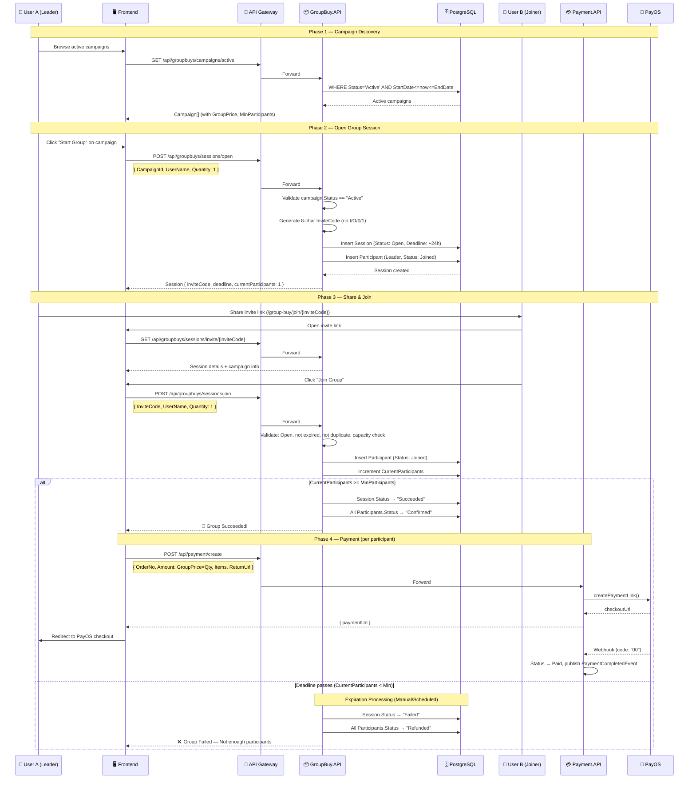
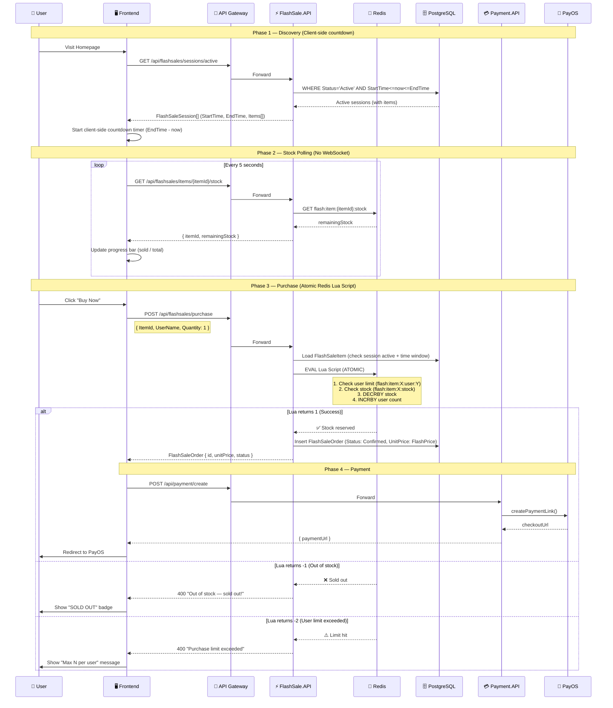
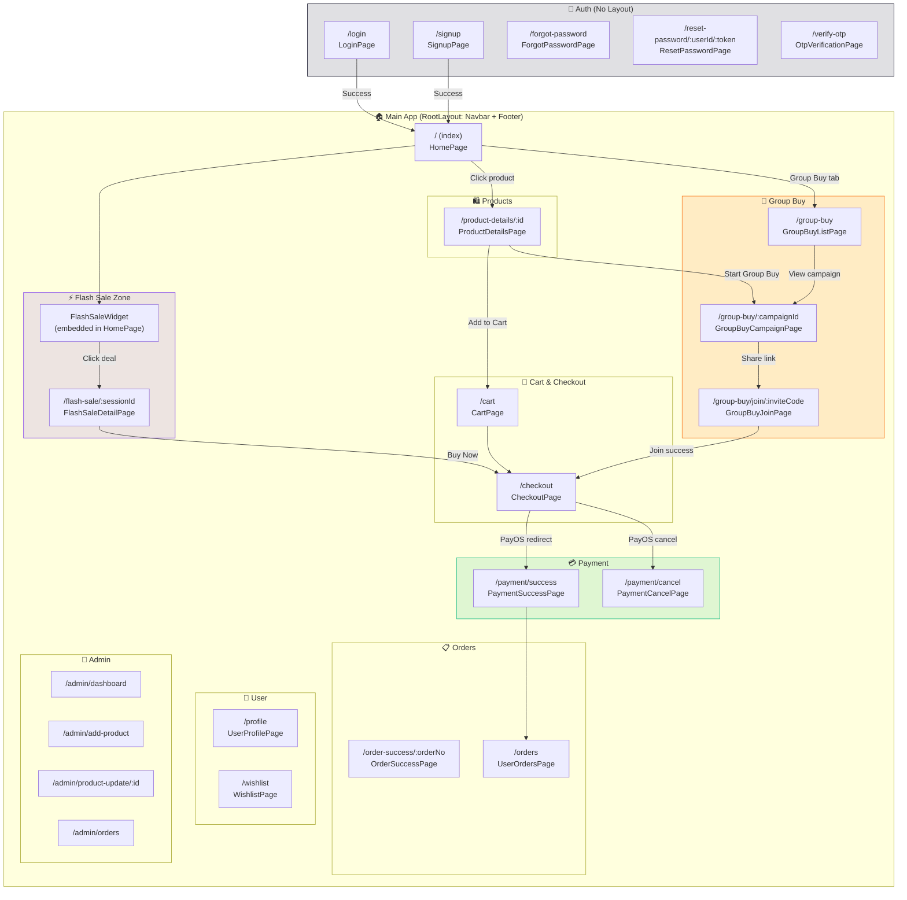
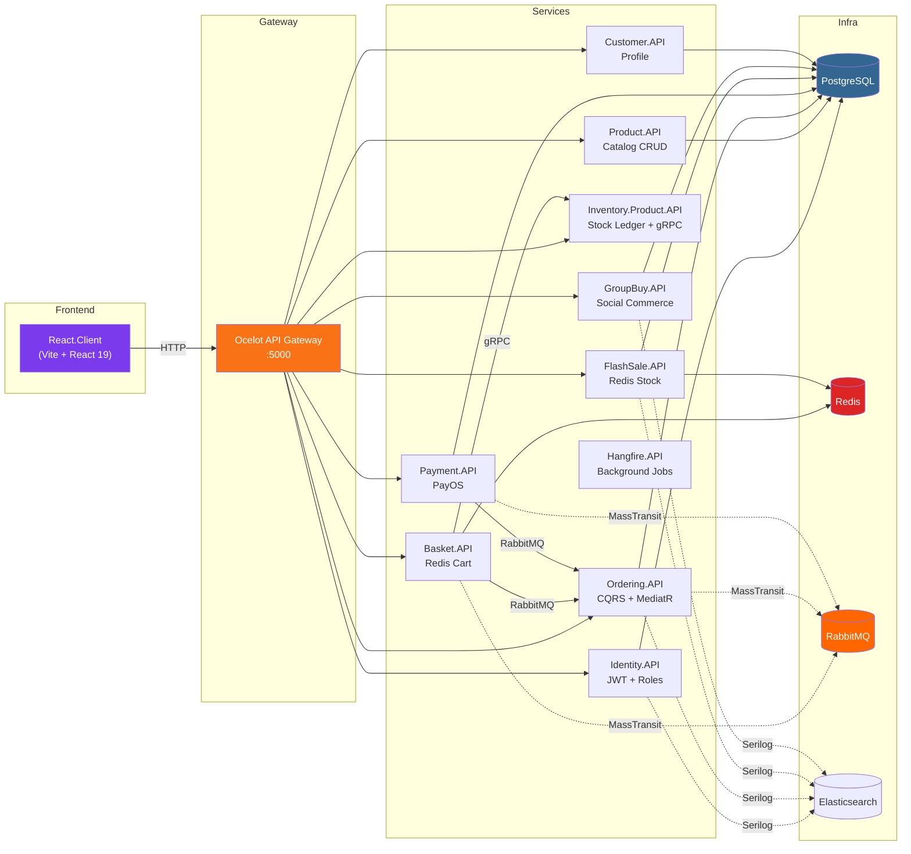

# Nexus Commerce — Architecture & Flow Documentation

> Generated from forensic analysis of all 10 backend microservices.
> Last updated: 2026-02-16

---

## Diagram 1: The "Social Buying" Saga (GroupBuy)

---

## Diagram 2: The "Flash Sale" Rush

---

## Diagram 3: Unified Screen Flow

---

## Service Communication Map

---

## Key Architectural Notes

### What Makes Nexus Different from Standard E-Commerce

| Feature | Standard | Nexus |
|---------|----------|-------|
| **Flash Sales** | Static discount pages | Redis-backed atomic stock with Lua scripts, per-user limits, client-side countdown |
| **Group Buying** | N/A | Session-based social commerce with invite codes, auto-success threshold, deadline expiry |
| **Stock Management** | Single DB check | Dual: PostgreSQL ledger (Inventory) + Redis counters (FlashSale) |
| **Payment** | Stripe/PayPal | PayOS (Vietnamese market), webhook-driven status |
| **Auth** | Session/Cookie | JWT with role claims, refresh tokens, email confirmation |
| **Inter-service** | Monolith | RabbitMQ events (BasketCheckout → Order), gRPC (Basket → Inventory stock check) |
| **Architecture** | MVC | CQRS (Ordering), Event-Driven, separated read/write paths |
